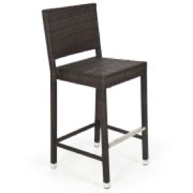

# Image Based Sales Captioning

## Overview
This repository contains a image captioning/description net that can be used to automatically create simple descriptions for furniture.

If you are just here to read a notebook on how to build a image captioning net in Keras 2 and TensorFlow, you can follow through the notebook [here!](#notebook-that-doesn't exist yet)

## Motivation

Many large companies are exploring Augmented Reality ‘AR’ as it becomes mainstream. Walmart in particular is considering using this technology to enhance their home furnishings business. One goal is to take a photo from a room in a customer’s house and use AR to make recommendations for furniture they should add or swap out. Below is an example of the goal of this project.

### Example
|Image|Caption|
|-------------|-----|
||Wood Metal Coffee Table |
||Black Modern Sectional Sofa|
||Brown Modern Bar Stools

## Table of Contents
1. [Overview of Nets Used](#overview-of-nets-used)
2. [Methodology](#methodology)
    * [Scraping](#scraping)
    * [Sample Data](#sample-data)
    * [Processing](#processing)
    * [Net Architecture](#net-architecture)
3. [Results](#results)
4. [Criticisms of the Model](#evaluations-and-criticizing-the-model)
5. [Core ML](#core-ml)
6. [Next Steps](#next-steps)
7. [Tech Stack](#tech-stack)
8. [References](#references)

## Overview of Nets Used
### VGG16
VGG116 is a convolutional neural net designed by and trained by the Visual Geometry Group of Oxford. It has become popularized and used as the basis for many image based nets. VGG16 uses smaller filters in a deeper fashion. This allows for better handling of non-linear features, which tend to be important in images when looking for patterns. Within this repository a VGGG16 net that has been pretrained on ImageNet data is used. I truncated the net early and as result was able to use the output from one of the final dense layers as the input to me net. The summary of the net used can be found [here.](images/vgg_architecture.png)

* RNN(LSTM, Bidirectional LSTM)

## Methodology
### Scraping
### Sample Data
### Processing
### Net Architecture

## Results
### The Good
### The Bad
### The Ugly

## Evaluations and Criticizing the Model
## Core ML
## Next Steps
## Tech Stack
## References
