# Image Based Sales Captioning

## Overview
This repository contains a image captioning/description net that can be used to automatically create simple descriptions for furniture.

If you are just here to read a notebook on how to build a image captioning net in Keras 2 and TensorFlow, you can follow through the notebook [here!](#notebook-that-doesn't exist yet)

## Motivation

Many large companies are exploring Augmented Reality ‘AR’ as it becomes mainstream. Walmart in particular is considering using this technology to enhance their home furnishings business. One goal is to take a photo from a room in a customer’s house and use AR to make recommendations for furniture they should add or swap out. Below is an example of the goal of this project.

### Example
<table>
  <tr>
    <th>Image</th>
    <th>Caption</th>
    <th>Image</th>
    <th>Caption</th>
  </tr>
  <tr>
    <td>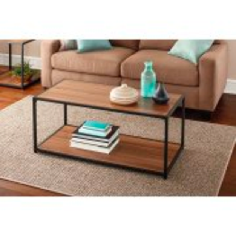</td>
    <td>Wood Metal Coffee Table</td>
    <td>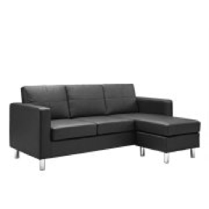</td>
    <td>Black Modern Sectional Sofa</td>
  </tr>

</table>

## Table of Contents
1. [Overview of Nets Used](#overview-of-nets-used)
2. [Methodology](#methodology)
    * [Scraping](#scraping)
    * [Sample Data](#sample-data)
    * [Processing](#processing)
    * [Net Architecture](#net-architecture)
3. [Results](#results)
4. [Criticisms of the Model](#evaluations-and-criticizing-the-model)
5. [Core ML](#core-ml)
6. [Next Steps](#next-steps)
7. [Tech Stack](#tech-stack)
8. [References](#references)

## Overview of Nets Used
### VGG16
VGG116 is a convolutional neural net designed by and trained by the Visual Geometry Group of Oxford [(1)](#references). It has become popularized and used as the basis for many image based nets. VGG16 uses smaller filters in a deeper fashion. This allows for better handling of non-linear features, which tend to be important in images when looking for patterns. Within this repository a VGG16 net that has been pretrained on ImageNet data is used. I truncated the net early and as result was able to use the output from one of the final dense layers as the input to my net. The summary output of the net used can be found [here.](images/vgg_architecture.png)

### LSTM

### Bidirectional LSTM

* RNN(LSTM, Bidirectional LSTM)

## Methodology
### Scraping
### EDA
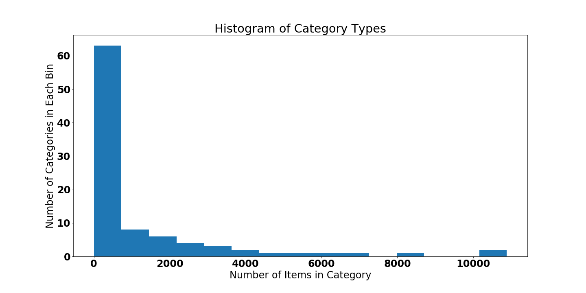

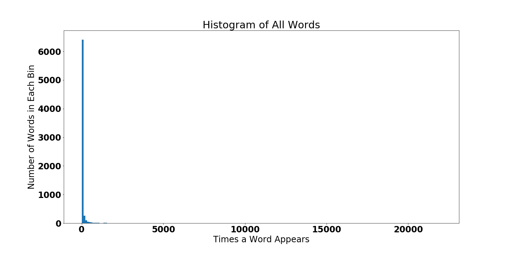

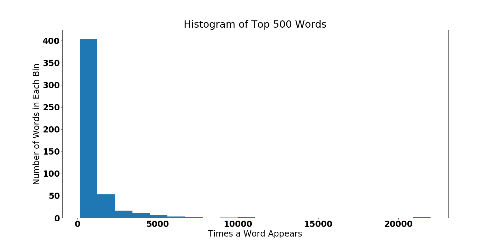

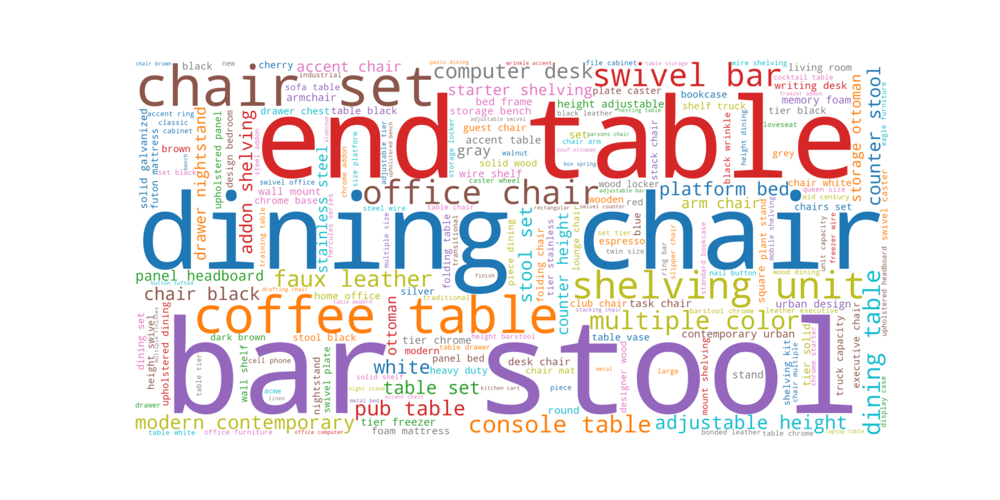
### Sample Data

### Processing
### Net Architecture

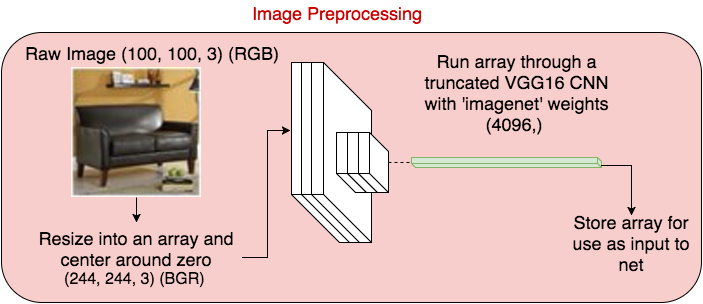

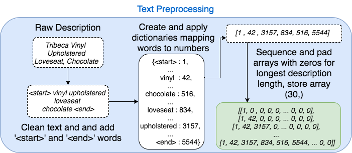

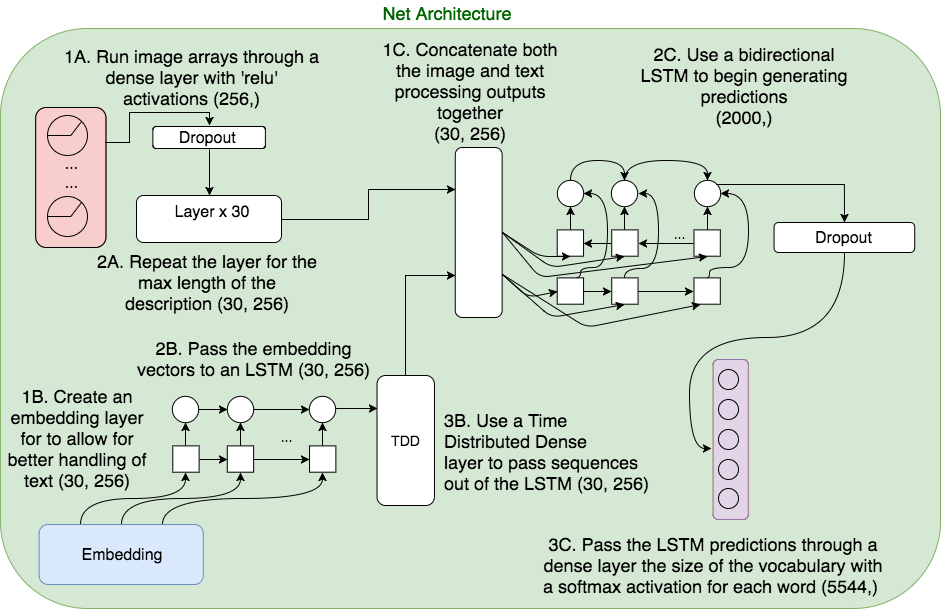

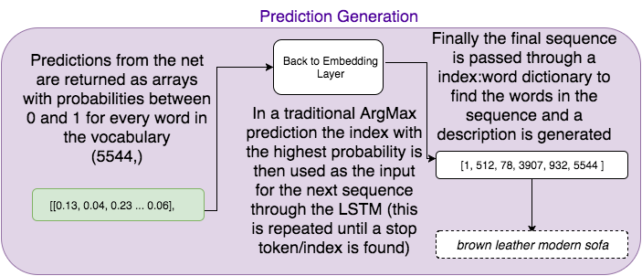

## Results

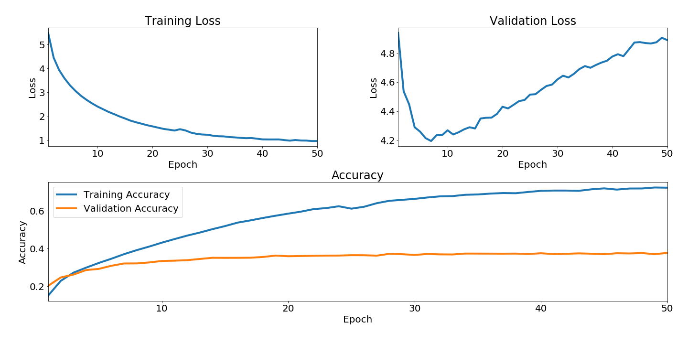
### The Good

| Epoch | Bed with Mattress | Wire Shelving | Night Stand | Groovy Book Case | Bar Stool | Hutch |
| ----- | ----------------- | ------------- | ----------- | ---------------- | --------- | ----- |

  
|   N/A  | 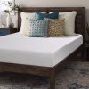||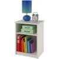|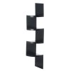|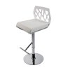|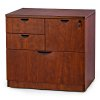
| 1| panel bed| tier addon truck|bookcase shelf|tier shelf shelf shelf|bar stool|drawer nightstand|
| 2|upholstered platform bed|tier chrome addon shelving unit|drawer nightstand|modern contemporary urban design table black|adjustable adjustable bar stool|drawer nightstand|
|3| gel memory foam mattress multiple sizes |tier chrome starter shelving unit|storage nightstand white|modern contemporary urban design wall room room room room room desk room desk stand|swivel bar stool set|drawer nightstand cherry|
|9 |piper platform bed espresso|tier chrome addon shelving unit|computer desk hutch|tier floating wall mount floating wall mount solid decor|adjustable height swivel bar stool|drawer file cabinet milled cherry|
|25|air flow queensize box spring memory foam mattress set|tier sided wire shelf truck rods|hannah drawer nightstand white|folding portable laptop table portable laptop table home office black|adjustable height swivel bar stool|drawer lateral file cabinet classic oak|
|50|continental gel memory foam mattress topper|capacity mobile unit wire shelves solid shelf|nightstand soft white|console table black|arctic contemporary black vinyl adjustable height barstool chrome base|ascent file cabinet polyvinyl chloride aluminum file drawers legal letter durable stain resistant locking|

### The Bad
### The Ugly

## Evaluations and Criticizing the Model
## Core ML
## Other Applications
## Next Steps
## Tech Stack
## References
(1) Very Deep Convolutional Networks for Large-Scale Image Recognition  
K. Simonyan, A. Zisserman  
arXiv:1409.1556 [[link]](#https://arxiv.org/abs/1409.1556)
