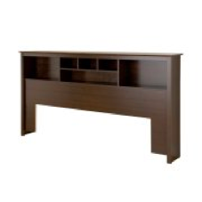

# Walmart Furniture Image Classification and Captioning

## Note:

The project is in progress, with a Minimum Viable Project deadline of late January.
## Background

Many large companies are exploring Augmented Reality ‘AR’ as it becomes mainstream. Walmart in particular is considering using this technology to enhance their home furnishings business. Walmart’s goal is to take a photo from a room in a customer’s house and use AR to make recommendations for furniture they should add or swap out. This is a large project that would likely take a team of data scientists and UX/UI engineers to accomplish, as a result I will start small. For Walmart, this project consists of:
1.	Automating their current image classifications
2.	Automating their current image captioning (descriptions)
3.	Determining multiple objects in one room
4.	Making recommendations for new objects based on objects already in room
5.	UI/UX Augmented Reality programming that is beyond the scope of my knowledge
There are many steps to this project and I would like to start with the first few as outlined below.  

## Goal

For my project, I plan to develop an automatic image classification for various furniture types, and then create text descriptions based on the image. The descriptions will have two uses for Walmart. First, they will reveal important keywords that someone in marketing might miss when they write their descriptions. Second, they will allow Walmart to better describe images and the objects within them, which could be used for creating recommendation engines.

## Steps

Multiple steps to get and collect data:
1.	Scrape Product ID’s from Walmart’s website in the furniture section
  * Approximately 400,000 entries
  *  I will likely use about 100,000 but it will depend on results
2.	Use Walmart’s API to get product information and images for each product ID
  * API returns as a JSON dictionary
  * Limitations:
  
        *	API restricted to 20 product ID’s per call
        *	5 calls per second
        *	5,000 calls per day
3.	Store all info in a MongoDB Database
  * Query required info and download pictures from URL’s
  * Medium sized pictures are 180 pixels x 180 pixels with white boundaries
4.	Use the pictures as features and the in other information as labels and train a net

## Project Progression

### Minimum Viable Product:
1.	Get all data from webscraping into a MongoDB database
2.	Use a CNN to predict furniture category based on image.
  * Example Below (Walmart’s Categories are plural)

|Image(Simple)|Label|Image(Challenging)|Label|
|-------------|-----|------------------|-----|
||Bar Stools|| Bar Stools
||Coffee Tables||Headboards|
||Sectional Sofa||Accessories/Mattresses|

### Improvement 1:
1.	Predict short description or key words based off image
2.	Likely use a CNN to feed into a LSTM

|Image(Simple)|Label|
|-------------|-----|
||Wood, Metal, Coffee Table |
||Black, Modern, Sectional Sofas|
||Black, Modern, Bar Stools|

### Improvement 2:
1.	Figure out how to use segmentation to determine multiple items in one image

|Image(Simple)|Label|
|-------------|-----|
||<ul><li>Wood, Metal Coffee Table</li><li>Tan Sofa </li><li>Wood, Metal End Table </li></ul>

### Improvement 3:
1. Use clustering or some other method to make text recommendations

|Image(Simple)|Label|Recommendation|
|-------------|-----|--------------|
||<ul><li>Wood, Metal Coffee Table</li><li>Tan Sofa </li><li>Wood, Metal End Table </li></ul>| <ul><li>Beige Floor Lamp</li><li>Tan Ottoman</li></ul>|

### Improvement 4:
1.	Use clustering or some other method to make product recommendations based on text descriptions

|Image(Simple)|Recommendation|Recommendation(Image)|
|-------------|--------------|-------|
|| <ul><li>Beige Floor Lamp</li><li>Tan Ottoman</li></ul>|<ul><li></li><li>Decmode 59 Inch Contemporary Iron and Bamboo Floor Lamp, Beige</li></ul>
